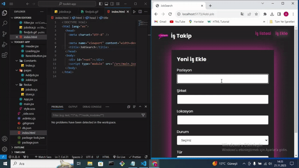

# JobSearch

- Projemde, HTTP isteklerini yönetmek için axios'u, değişkenler ve mixin gibi özelliklerle geliştirilmiş CSS stillemesi için sass'i, ön uç testleri için JSON dosyalarını kullanarak hızlıca bir sahte RESTful API oluşturmak için json-server'ı, Redux durum yönetimini React bileşenlerine entegre etmek için react-redux'i ve modern React uygulamalarında Redux kullanımını basitleştirmek ve tekrarlayan kodları azaltmak için @reduxjs/toolkit'i kullandım.

# Kütüphaneler

- react-router-dom
- axios
- sass
- react-tostify
- json-server
- react-redux
- @reduxjs/toolkit
- uuid

<h2>gif</h2>

